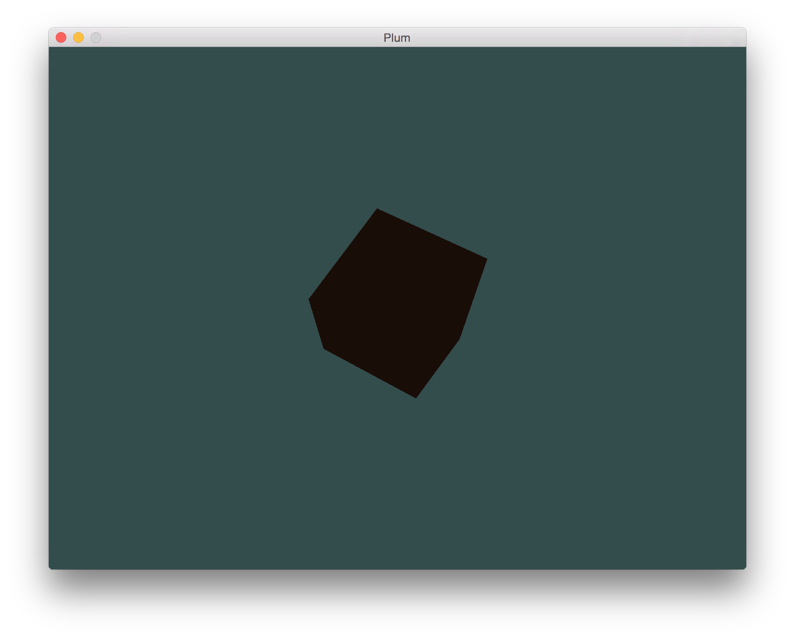

# Plum
Plum, a Lisp-powered Ultimate Modeler



## Build environment setup
### 1. Install MSYS2
  from https://msys2.github.io/.

  Follow all the instructions in there.

### 2. Install MinGW packages in MSYS2
MSYS2 comes with functionalities to easily install all MinGW related packages
and automatically upgrade them.

Execute MinGW-w64 Win64 Shell.  
We can find it by typing "mingw-w64" in the windoze button
or whatever  they call it.

Brief how-to for the pacman package manager:

* Installing
  ```
  pacman -S <package-name1> <package-name2> ...
  ```

* Removing
  ```
  pacman -R <package-name1> <package-name2> ...
  ```

* Upgrading the whole system
  ```
  pacman -Syu
  ```

* Searching
  ```
  pacman -Ss <query-string>
  ```

* Viewing package info
  ```
  pacman -Si <package-name>
  ```

* Searching from installed packages
  ```
  pacman -Qs <package-name>
  ```

Using above commands, install following packages:
- mingw-w64-x86_64-gcc
- mingw-w64-x86_64-make
- git
- tar (For extracting, may use AlZip crapware as well)

### 3. Download and extract Chicken Scheme source tarball 
from http://code.call-cc.org/.  
Recommended version is *chicken-4.9.0.1.tar.gz*.
  
In the MSYS2 shell, go to the directory the tarball is in
by typing:

  ```
  cd C:/Users/<accountname>/<folder>
  ```
(note usage of **forward slash**)
  
Then, extract the tarball by typing:
  ```
  tar zxvf chicken-<verion>.tar.gz
  ```
(I have no idea either)

### 4. Build Chicken Scheme (the tricky part)
We are going to use the installed mingw-w64 toolchains
to build Chicken.

To do so, first `cd` into the extracted directory, and then

1. Execute the following

  ```
  mingw32-make PLATFORM=mingw-msys ARCH=x86-64 PREFIX=C:/chicken
  mingw32-make PLATFORM=mingw-msys ARCH=x86-64 PREFIX=C:/chicken install
  ```
  
  (again, note the **forward slash**)

  The C:/chicken part can be any folder you want, just be consistent.
  
2. If anything wants to fail with error messages, execute the following

  ```
  mingw32-make PLATFORM=mingw-msys ARCH=x86-64 PREFIX=C:/chicken clean
  mingw32-make PLATFORM=mingw-msys ARCH=x86-64 PREFIX=C:/chicken confclean
  ```

  Troubleshoot if possible, and repeat step 1.

### 5. Add Chicken binaries to the PATH variable

Add `C:\chicken\bin` to the end of the Account PATH variable.  
(This time **backward slashes** are needed.)

You can open the dialog by searching "계정의 환경 변수 편집" in the
Windows menu.

## How to build
```
gcc -c fib.c
csc -o fib-user fib.o fib-user
```
